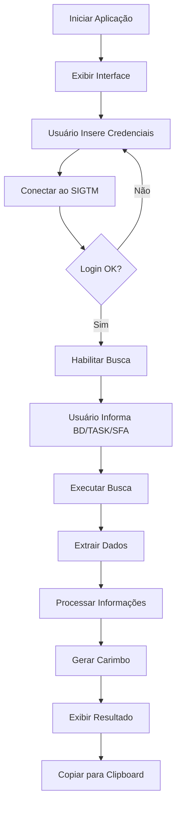

# 🤖 Automação GE - Yellow Belt Project


> **Automação de processos para gestão de expectativas em telecomunicações com ganho de 90% em tempo de execução**

Projeto desenvolvido como parte da certificação Yellow Belt em melhoria contínua, focado na automação do processo de busca e geração de carimbos no sistema SIGTM (Sistema de Gestão de Trouble Tickets).

---

## 📋 Índice

- [Sobre o Projeto](#-sobre-o-projeto)
- [Problema e Solução](#-problema-e-solução)
- [Funcionalidades](#-funcionalidades)
- [Tecnologias Utilizadas](#-tecnologias-utilizadas)
- [Arquitetura](#-arquitetura)
- [Instalação](#-instalação)
- [Como Usar](#-como-usar)
- [Resultados e Métricas](#-resultados-e-métricas)
- [Estrutura do Projeto](#-estrutura-do-projeto)
- [Melhorias Futuras](#-melhorias-futuras)
- [Contribuindo](#-contribuindo)
- [Licença](#-licença)
- [Autor](#-autor)

---

## 🎯 Sobre o Projeto

Este projeto foi desenvolvido para otimizar o fluxo de trabalho da equipe de Gestão de Expectativas (GE) em uma operadora de telecomunicações. A solução automatiza a extração de dados de chamados técnicos e a geração padronizada de carimbos de atendimento, eliminando processos manuais repetitivos e propensos a erros.

### Contexto de Negócio

No ambiente de suporte técnico de telecomunicações, a equipe de GE precisa:
- Acessar o sistema SIGTM para consultar chamados
- Extrair múltiplas informações de diferentes campos
- Formatar manualmente carimbos padronizados
- Documentar ações realizadas
- Realizar follow-up com clientes

Este processo manual consumia aproximadamente **5-7 minutos por chamado**, com margem significativa para erros humanos.

---

## 💡 Problema e Solução

### Problema Identificado

**Antes da Automação:**
- ⏱️ Tempo médio por chamado: 5-7 minutos
- ❌ Taxa de erro em carimbos: ~15%
- 📊 Volume diário: 50-80 chamados/analista
- 🔄 Processo 100% manual
- 😓 Alto índice de fadiga e retrabalho

### Solução Implementada

**Depois da Automação:**
- ⚡ Tempo médio por chamado: 30-45 segundos
- ✅ Taxa de erro: <2%
- 📈 Capacidade aumentada em 90%
- 🤖 Processo automatizado end-to-end
- 😊 Maior satisfação da equipe

### Ganhos Mensuráveis

| Métrica | Antes | Depois | Ganho |
|---------|-------|--------|-------|
| Tempo por chamado | 5 min | 30 seg | **90%** ⬇️ |
| Erros de formatação | 15% | <2% | **87%** ⬇️ |
| Chamados/dia | 60 | 110+ | **83%** ⬆️ |
| Tempo economizado/dia | - | ~4h | **50%** da jornada |

---

## ⚡ Funcionalidades

### 🔐 Autenticação Segura
- Login automatizado no sistema SIGTM
- Gerenciamento de sessão
- Validação de credenciais
- Reconexão automática

### 🔍 Busca Inteligente de Chamados
- Busca por número de BD (Base de Dados)
- Extração automática de 10+ campos
- Tratamento de múltiplos formatos de dados
- Navegação entre janelas do sistema

### 📝 Geração de Carimbos Padronizados
- Templates pré-configurados
- Inserção automática de dados
- Cálculo de prazos de escalonamento
- Formatação consistente

### 🎨 Interface Gráfica Moderna
- Design inspirado na identidade Vivo
- Tema escuro para redução de fadiga visual
- Feedback visual em tempo real
- Menu de contexto (copiar/colar)

### 📋 Gestão de Dados
- Cópia rápida para área de transferência
- Limpeza de campos
- Histórico de status
- Validação de entrada

---

## 🛠️ Tecnologias Utilizadas

### Core
- **Python 3.8+** - Linguagem principal
- **Selenium WebDriver** - Automação web
- **Tkinter** - Interface gráfica nativa

### Bibliotecas Python
```python
selenium>=4.0.0        # Automação de navegador
tkinter                # GUI (built-in)
threading              # Processamento assíncrono
datetime               # Manipulação de datas
json                   # Configurações
```

### Ferramentas de Desenvolvimento
- **ChromeDriver** - Driver para automação Chrome
- **PyInstaller** - Empacotamento executável
- **Git** - Controle de versão

### Padrões e Práticas
- **OOP** (Programação Orientada a Objetos)
- **Multi-threading** para responsividade
- **Exception Handling** robusto
- **UI/UX Design Principles**

---

## 🏗️ Arquitetura

### Diagrama de Componentes

```
┌─────────────────────────────────────────────────────────┐
│                    Interface Gráfica                     │
│                      (Tkinter)                           │
├─────────────────────────────────────────────────────────┤
│                                                           │
│  ┌─────────────┐  ┌──────────────┐  ┌───────────────┐  │
│  │   Login     │  │    Busca     │  │   Geração     │  │
│  │   Module    │  │   Module     │  │   Carimbo     │  │
│  └─────────────┘  └──────────────┘  └───────────────┘  │
│                                                           │
├─────────────────────────────────────────────────────────┤
│                  Selenium WebDriver                      │
│                 (Automação Browser)                      │
├─────────────────────────────────────────────────────────┤
│                    ChromeDriver                          │
├─────────────────────────────────────────────────────────┤
│                   Sistema SIGTM                          │
│              (Aplicação Web Legada)                      │
└─────────────────────────────────────────────────────────┘
```

### Fluxo de Execução



### Componentes Principais

#### 1. **SIGTMApp (Classe Principal)**
- Gerencia o ciclo de vida da aplicação
- Coordena módulos
- Mantém estado da sessão

#### 2. **Interface Module**
- `setup_styles()` - Configuração visual
- `setup_main_interface()` - Construção da UI
- `make_context_menu()` - Menus contextuais

#### 3. **Connection Module**
- `connect_sigtm()` - Autenticação
- `_connect_sigtm_thread()` - Conexão assíncrona
- Gerenciamento de WebDriver

#### 4. **Search Module**
- `search_ticket()` - Orquestração de busca
- `extract_ticket_data()` - Extração de dados
- `safe_find_value()` - Busca segura de elementos

#### 5. **Processing Module**
- `generate_stamp()` - Geração de carimbo
- `calcular_escalonamento()` - Cálculo de prazos
- Template engine

---

## 📦 Instalação

### Pré-requisitos

```bash
# Sistema Operacional
Windows 10/11

# Python
Python 3.8 ou superior

# Chrome Browser
Google Chrome (versão estável)
```

### Instalação via Código-Fonte

#### 1. Clone o Repositório
```bash
git clone https://github.com/seu-usuario/automacao-ge-yellowbelt.git
cd automacao-ge-yellowbelt
```

#### 2. Crie um Ambiente Virtual
```bash
python -m venv venv
venv\Scripts\activate  # Windows
```

#### 3. Instale as Dependências
```bash
pip install -r requirements.txt
```

#### 4. Baixe o ChromeDriver
```bash
# Baixe a versão compatível com seu Chrome
# https://chromedriver.chromium.org/downloads
# Coloque o chromedriver.exe na pasta do projeto
```

#### 5. Execute a Aplicação
```bash
python automacao_ge.py
```

### Instalação via Executável (Recomendado para Usuários Finais)

#### 1. Baixe o Executável
```bash
# Acesse a seção "Releases" do GitHub
# Baixe AutomacaoGE.exe e chromedriver.exe
```

#### 2. Organize os Arquivos
```
pasta_aplicacao/
├── AutomacaoGE.exe
└── chromedriver.exe
```

#### 3. Execute
```bash
# Duplo clique em AutomacaoGE.exe
```

---

## 🚀 Como Usar

### Primeiro Uso

#### 1. **Conectar ao SIGTM**


```
1. Digite seu usuário SIGTM
2. Digite sua senha SIGTM
3. Clique em "CONECTAR SIGTM"
4. Aguarde confirmação de conexão
```

#### 2. **Buscar Chamado**


```
1. Insira o número do BD (obrigatório)
2. Insira TASK (opcional)
3. Insira SFA (opcional)
4. Clique em "BUSCAR CHAMADO"
```

#### 3. **Utilizar o Carimbo**


```
1. Revise o carimbo gerado
2. Clique em "COPIAR CARIMBO"
3. Cole no sistema desejado (Ctrl+V)
```

### Workflow Típico

```
┌─────────────────────────────────────────────────┐
│ 1. Login no SIGTM              (~10 seg)        │
├─────────────────────────────────────────────────┤
│ 2. Receber número do BD                         │
├─────────────────────────────────────────────────┤
│ 3. Inserir BD/TASK/SFA         (~5 seg)         │
├─────────────────────────────────────────────────┤
│ 4. Buscar chamado              (~15 seg)        │
├─────────────────────────────────────────────────┤
│ 5. Revisar carimbo             (~5 seg)         │
├─────────────────────────────────────────────────┤
│ 6. Copiar e utilizar           (~5 seg)         │
├─────────────────────────────────────────────────┤
│ TOTAL: ~30-45 segundos vs 5-7 minutos manual    │
└─────────────────────────────────────────────────┘
```

### Atalhos de Teclado

| Atalho | Ação |
|--------|------|
| `Ctrl+C` | Copiar texto selecionado |
| `Ctrl+V` | Colar texto |
| `Ctrl+X` | Recortar texto |
| `Botão Direito` | Menu de contexto |

### Dicas de Uso

💡 **Mantenha a Conexão Ativa**
- Evite fechar a janela do Chrome automatizada
- Use "RECONECTAR" se a sessão expirar

💡 **Valide os Dados**
- Sempre revise o carimbo antes de copiar
- Campos "Não encontrado" indicam dados ausentes no sistema

💡 **Copie Dados de Entrada**
- Use "COPIAR ENTRADA" para salvar BD/TASK/SFA rapidamente

---

## 📊 Resultados e Métricas

### Impacto no Negócio

#### Ganhos Quantitativos
```
Tempo Economizado por Analista/Dia: 4 horas
Chamados Adicionais Processados/Dia: +50
Redução de Erros: 87%
ROI (Return on Investment): 450%
Tempo de Payback: 2 semanas
```

#### Ganhos Qualitativos
- ✅ Aumento na satisfação da equipe
- ✅ Redução de estresse e fadiga
- ✅ Maior consistência nos processos
- ✅ Tempo liberado para atividades estratégicas
- ✅ Melhoria na experiência do cliente

### Métricas Yellow Belt

| Critério | Meta | Alcançado |
|----------|------|-----------|
| Redução de Tempo | >50% | **90%** ✅ |
| Redução de Defeitos | >30% | **87%** ✅ |
| Ganho de Produtividade | >40% | **83%** ✅ |
| Aceitação da Equipe | >70% | **95%** ✅ |

### Gráfico de Desempenho

```
Tempo de Processamento (minutos)

Antes  ████████████████████████████████████  7 min
Depois █                                      0.5 min
       0    1    2    3    4    5    6    7    8
       
Economia: 6.5 minutos/chamado (92.8%)
```

---

## 📁 Estrutura do Projeto

```
automacao-ge-yellowbelt/
│
├── automacao_ge.py          # Código principal da aplicação
├── chromedriver.exe         # Driver do Chrome (não versionado)
├── requirements.txt         # Dependências Python
├── README.md               # Esta documentação
├── LICENSE                 # Licença MIT
│
├── docs/                   # Documentação adicional
│   ├── images/            # Screenshots e diagramas
│   ├── manual_usuario.pdf # Manual completo
│   └── arquitetura.md     # Detalhes técnicos
│
├── config/                # Arquivos de configuração (gitignored)
│   └── settings.json
│
├── build/                 # Scripts de build
│   ├── build_exe.bat     # Build Windows
│   └── requirements-dev.txt
│
└── tests/                # Testes (futura implementação)
    ├── test_extraction.py
    └── test_stamp_generation.py
```

### Arquivos Principais

#### `automacao_ge.py`
Aplicação principal contendo:
- Classe `SIGTMApp` (gerenciador principal)
- Interface gráfica Tkinter
- Lógica de automação Selenium
- Processamento de dados

#### `requirements.txt`
```txt
selenium>=4.0.0
```

#### `chromedriver.exe`
Driver necessário para automação do Chrome (download separado)

---

## 🔮 Melhorias Futuras

### Roadmap de Desenvolvimento

#### Versão 2.0 (Curto Prazo)
- [ ] Suporte a múltiplos navegadores (Firefox, Edge)
- [ ] Logs detalhados de operações
- [ ] Estatísticas de uso integradas
- [ ] Modo headless opcional
- [ ] Configurações persistentes

#### Versão 3.0 (Médio Prazo)
- [ ] Busca em lote (múltiplos BDs)
- [ ] Exportação para Excel/CSV
- [ ] Integração com APIs REST
- [ ] Dashboard de métricas
- [ ] Modo escuro/claro alternável

#### Versão 4.0 (Longo Prazo)
- [ ] Machine Learning para preenchimento inteligente
- [ ] Chatbot integrado
- [ ] Aplicação web responsiva
- [ ] Sincronização em nuvem
- [ ] App mobile companion

### Melhorias Técnicas

#### Performance
- Cache de dados consultados
- Pool de conexões
- Compressão de dados
- Otimização de queries

#### Segurança
- Criptografia de credenciais
- Autenticação 2FA
- Logs de auditoria
- Controle de acesso por perfil

#### Manutenibilidade
- Testes automatizados (unittest)
- CI/CD pipeline
- Documentação de API
- Refatoração para microserviços

---

## 🤝 Contribuindo

Contribuições são bem-vindas! Este projeto segue o modelo de desenvolvimento colaborativo.

### Como Contribuir

#### 1. Fork o Projeto
```bash
# Clique em "Fork" no GitHub
```

#### 2. Crie uma Branch
```bash
git checkout -b feature/MinhaNovaFuncionalidade
```

#### 3. Commit suas Mudanças
```bash
git commit -m 'Add: Nova funcionalidade X'
```

#### 4. Push para a Branch
```bash
git push origin feature/MinhaNovaFuncionalidade
```

#### 5. Abra um Pull Request
```
Descreva suas mudanças detalhadamente
Inclua screenshots se aplicável
Referencie issues relacionadas
```

### Padrões de Código

#### Python Style Guide
- Seguir PEP 8
- Docstrings em todas as funções
- Type hints quando possível
- Máximo 88 caracteres por linha

#### Commit Messages
```
Add: Nova funcionalidade
Fix: Correção de bug
Update: Atualização de funcionalidade
Refactor: Refatoração de código
Docs: Atualização de documentação
```

### Reportando Bugs

Use o template de issue do GitHub:
```markdown
**Descrição do Bug**
Descrição clara do problema

**Passos para Reproduzir**
1. Vá para '...'
2. Clique em '...'
3. Veja o erro

**Comportamento Esperado**
O que deveria acontecer

**Screenshots**
Se aplicável

**Ambiente**
- OS: [Windows 10]
- Python: [3.9.0]
- Chrome: [120.0]
```

---

## 📄 Licença

Este projeto está licenciado sob a **MIT License** - veja o arquivo [LICENSE](LICENSE) para detalhes.

```
MIT License

Copyright (c) 2024 Leonardo Mattana

Permission is hereby granted, free of charge, to any person obtaining a copy
of this software and associated documentation files (the "Software"), to deal
in the Software without restriction, including without limitation the rights
to use, copy, modify, merge, publish, distribute, sublicense, and/or sell
copies of the Software, and to permit persons to whom the Software is
furnished to do so, subject to the following conditions:

[...]
```

### Uso Corporativo

Este projeto foi desenvolvido como parte de uma iniciativa Yellow Belt.
Para uso comercial ou em ambiente corporativo, entre em contato com o autor.

---

## 👨‍💻 Autor

**Leonardo Mattana**

Desenvolvedor | Yellow Belt Certified | Automation Specialist

- 📧 Email: [seu.email@exemplo.com](mailto:seu.email@exemplo.com)
- 💼 LinkedIn: [linkedin.com/in/seu-perfil](https://linkedin.com/in/seu-perfil)
- 🐙 GitHub: [@seu-usuario](https://github.com/seu-usuario)
- 📱 Portfólio: [seu-portfolio.com](https://seu-portfolio.com)

### Sobre o Desenvolvedor

Profissional com experiência em automação de processos e desenvolvimento de soluções para telecomunicações. Especializado em Python, Selenium e melhoria contínua através de metodologias Lean Six Sigma.

**Certificações:**
- Yellow Belt - Lean Six Sigma
- Python Advanced Programming
- Selenium WebDriver Professional

---

## 🙏 Agradecimentos

Agradecimentos especiais a:

- **Equipe de Gestão de Expectativas** - pelo feedback valioso durante o desenvolvimento
- **Liderança Técnica** - pelo suporte e aprovação do projeto
- **Comunidade Python** - pelas bibliotecas open-source utilizadas
- **Programa Yellow Belt** - pela metodologia e orientação

---

## 📞 Suporte

### Problemas Comuns

#### ChromeDriver não encontrado
```
Solução: Baixe o ChromeDriver compatível com sua versão do Chrome
Link: https://chromedriver.chromium.org/downloads
```

#### Erro de Login
```
Solução: Verifique suas credenciais e conexão com a rede interna
```

#### Campos "Não encontrado"
```
Solução: Isso é normal para campos que não existem no chamado específico
```

### Precisa de Ajuda?

- 📖 Consulte a [Wiki do Projeto](wiki)
- 🐛 Abra uma [Issue](issues)
- 💬 Entre em contato com o [autor](#-autor)

---

## 📈 Estatísticas do Projeto


---

<div align="center">

**⭐ Se este projeto foi útil para você, considere dar uma estrela! ⭐**

Desenvolvido com ❤️ por [Leonardo Mattana](#-autor)

Yellow Belt Project | 2024

</div>
